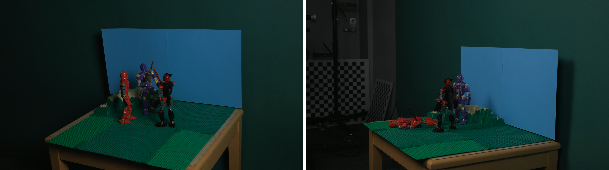

# Computational Illumination for Stop Motion
Vijender Bakhshi | Byron Wong | Ryan Zrymiak
____
<div style="text-align:center">
  
</div>

## Main Idea
Interpolate view and lighting of stop-motion scenes

### Motivation
Specifically stop-motion because we can capture different lighting and views per frame, not possible in real time capture. Post production fix or stylistic choice for camera angle and lighting

### Final Product
Application demo of view and lighting interpolation of captured scene with different angles and lighting
- [Project video](https://www.youtube.com/watch?v=sk5pPzuNjBY)
- [Project demo reel](https://www.youtube.com/watch?v=Npye2D20st4)

## Usage

### Requirements
A requirements file has been provided so getting requirements is simple:
```
python3 -m pip install -r requirements.txt
```

**NOTE**: Files are assumed to be in folders named `camera#`, where `#` is the camera number, and frames wihtin each camera folder are named `frame-#-###.png`, where `#` is the number of the light direction and `###` is the 3 digit frame number.

#### Sorting utility
[sort_frames.py](./sort_frames.py) can be used to rename frames in a camera folder to the above naming requirements from the default names provided from the Computational Photography lab.


### Running
To apply effects use the `main.py` program:
```
$ python3 main.py --help
usage: Editor.py [-h] --camera-dir CAMERA_DIR --camera {1,2,3,4,5,6,7,8} --effect
                 {cycle,daycycle,disco,lightning,police,underwater} [--lights [LIGHTS ...]] [--t-rate T_RATE]
                 [--zoom {wide,square}] [--verbose]

Applies effects to stop motion frames

optional arguments:
  -h, --help            show this help message and exit
  --camera-dir CAMERA_DIR
                        Path to cameras folder
  --camera {1,2,3,4,5,6,7,8}
                        Number of camera to pull frames from
  --effect {cycle,daycycle,disco,lightning,police,underwater}
                        Name of the effect to apply
  --lights [LIGHTS ...]
                        Light number args for police and cycle effects. Default = [1, 2]. Police: light nums for red
                        and blue (ordered) | Cycle: Order of light nums to transition between
  --t-rate T_RATE       Argument for cycle effect, number of frames to transition between 2 lights. Default 10
  --zoom {wide,square}  Flag to crop & resize frames to FHD. wide=16:9, square=4:3
  --verbose             Output indivitual frames along with video output
```

#### Example
```
$ python3 main.py --camera-dir ../new_frames --camera 5 --effect cycle --lights 1 2 3 --t-rate 5
```
This will produce an output video using camera `5` with the light `cycle` effect using lights `1 2 3` in that order. The effect will move between the lights in `5` frames throughout the video.